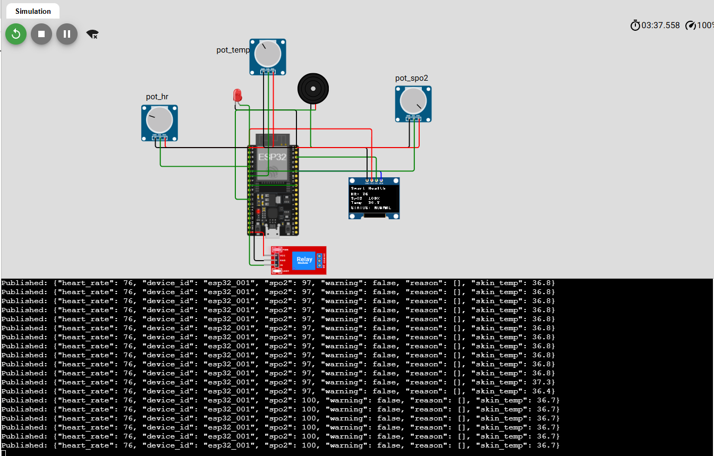
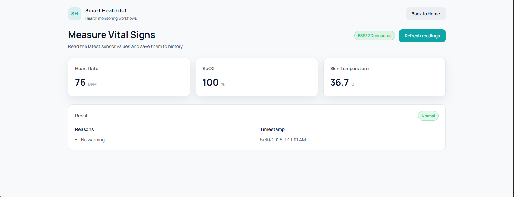
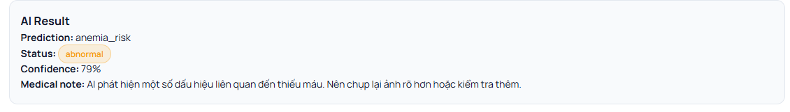
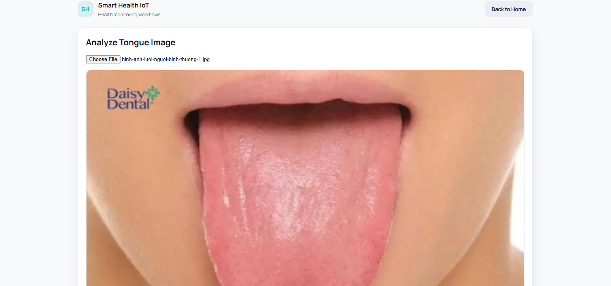
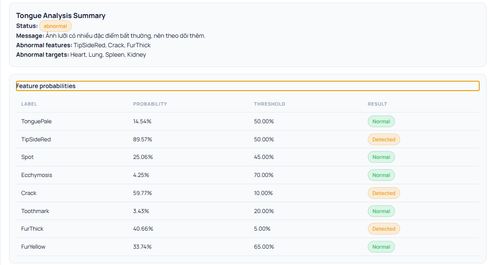
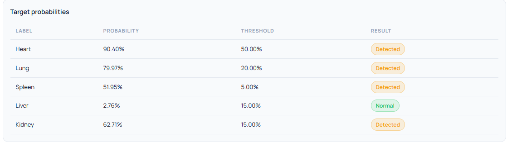
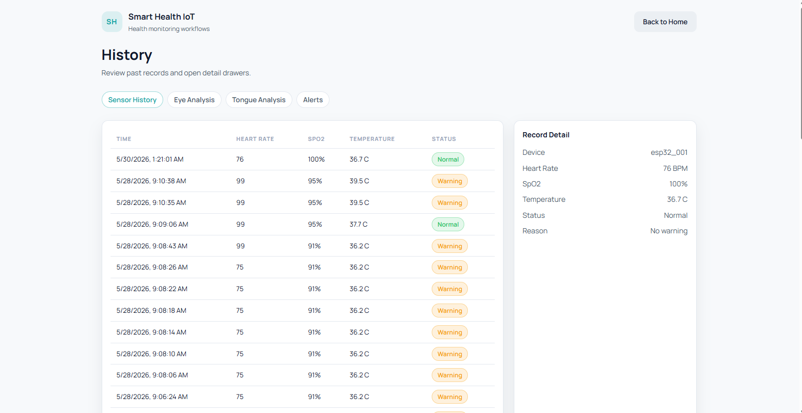
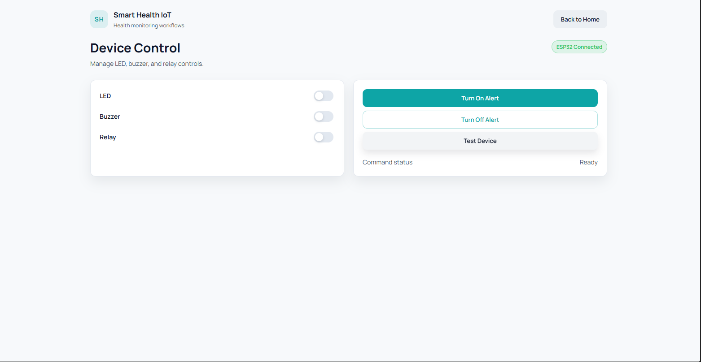

# Smart Health IoT System - Hệ thống Theo dõi Sức khỏe Thông minh tích hợp AI

**Smart Health IoT System** là một giải pháp toàn diện kết hợp giữa công nghệ IoT và Trí tuệ nhân tạo (AI) để hỗ trợ theo dõi sức khỏe, tầm soát nguy cơ thiếu máu và phân tích các chỉ số cơ thể một cách tự động và chính xác.

Hệ thống được thiết kế để cung cấp cái nhìn tổng quan về tình trạng sức khỏe thông qua việc thu thập dữ liệu từ cảm biến sinh hiệu và phân tích hình ảnh (mắt/lưỡi) bằng các mô hình học sâu.

---

## 📸 Tổng quan giao diện ứng dụng

Hệ thống cung cấp một bảng điều khiển trung tâm trực quan, cho phép người dùng dễ dàng truy cập vào các tính năng như theo dõi chỉ số sensor, thực hiện test AI, xem lịch sử và điều khiển thiết bị phần cứng.

---

## ✨ Các tính năng chính

### 1. Theo dõi sinh hiệu thời gian thực (IoT Dashboard)
Hệ thống kết nối trực tiếp với phần cứng (ESP32) thông qua giao thức **MQTT** để truyền tải dữ liệu sinh hiệu liên tục về Backend.

*   **Kết nối phần cứng**: Dữ liệu từ cảm biến được gửi trực tiếp lên Cloud/Backend.
    
*   **Dashboard trực quan**: Hiển thị Real-time các chỉ số: Nhịp tim (BPM), Nồng độ Oxy trong máu (SpO2), và Nhiệt độ da.
    

### 2. Tầm soát thiếu máu qua ảnh mắt (AI Eye Diagnosis)
Sử dụng mô hình AI (CNN) để phân tích vùng kết mạc mắt, giúp đưa ra cảnh báo sớm về nguy cơ thiếu máu (Anemia).
*   Kết quả trả về bao gồm trạng thái (Anemic/Non-Anemic), độ tin cậy (Confidence) và các khuyến nghị sức khỏe tương ứng.

### 3. Phân tích đặc điểm lưỡi (AI Tongue Analysis)
Hệ thống tích hợp mô hình **TongueDx multi-task** để phân tích đa diện các đặc điểm của lưỡi như: Lưỡi nhợt (Pale), Nứt lưỡi (Crack), Rêu lưỡi (Fur),... 
*   Quá trình phân tích được mô tả chi tiết qua các bước từ tải ảnh đến hiển thị kết quả phân loại đặc điểm và tình trạng các cơ quan nội tạng liên quan (Heart, Lung, Spleen, Liver, Kidney).

### 4. Quản lý lịch sử và Theo dõi tiến trình
Mọi dữ liệu đo đạc từ cảm biến và kết quả phân tích AI đều được lưu trữ an toàn trong cơ sở dữ liệu. Người dùng có thể dễ dàng xem lại lịch sử để theo dõi diễn biến sức khỏe theo thời gian.

### 5. Điều khiển thiết bị phần cứng từ xa
Người dùng có thể tương tác ngược lại với phần cứng ngay từ giao diện Web. Cho phép bật/tắt các thiết bị cảnh báo như LED, Còi (Buzzer), hoặc Rơ-le (Relay) để xử lý các tình huống khẩn cấp.

---

## 🛠 Công nghệ sử dụng

*   **Frontend**: ReactJS, Vite, TypeScript, TailwindCSS/CSS Modules.
*   **Backend**: FastAPI (Python), SQLAlchemy, SQLite.
*   **IoT/Hardware**: ESP32, MQTT (HiveMQ), Cảm biến MAX30102, MLX90614.
*   **AI/ML**: PyTorch, Torchvision, Mô hình CNN (Anemia & Tongue Analysis).

---

## 🚀 Hướng dẫn cài đặt và khởi chạy

### 1. Chạy Backend
`bash
cd apps/backend
pip install -r requirements.txt
uvicorn main:app --reload
`

### 2. Chạy Frontend
`bash
cd apps/frontend
npm install
npm run dev
`

---

> **Lưu ý quan trọng**: Hệ thống chỉ mang tính chất hỗ trợ theo dõi, sàng lọc và cảnh báo bất thường sức khỏe. Hệ thống không thay thế thiết bị y tế chuyên dụng hoặc chẩn đoán chính thức từ bác sĩ.
