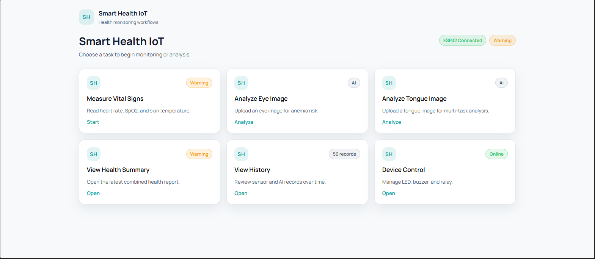
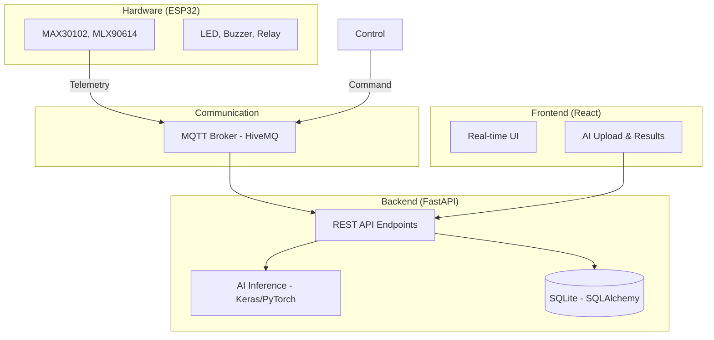

# Smart Health IoT System - AI-powered Health Monitoring System

**Smart Health IoT System** is an end-to-end project that combines IoT technology, backend services, and deep learning models to support **basic health monitoring and early risk screening**.

The system provides a comprehensive approach to health tracking by collecting real-time biometric data from ESP32 sensors and analyzing medical images (eye/tongue) using specialized neural networks.

---

## 📸 Application Overview

The system features an intuitive central dashboard for real-time sensor monitoring, AI diagnostic testing, history tracking, and remote hardware control.



---

## ✨ Key Features

### 1. Real-time Biometric Monitoring (IoT)
Connects to ESP32 hardware via **MQTT** protocol for continuous data streaming.
- **Hardware Integration**: Real-time heart rate (BPM), Blood Oxygen (SpO2), and Skin Temperature.
- **Remote Control**: Toggle hardware alerts (LED, Buzzer, Relay) directly from the web interface.

### 2. Eye-based Anemia Screening (AI)
Analyzes conjunctiva images to provide early alerts for anemia risk.
- **Current Result**: 93.80% Accuracy on test set (Prototype phase).
- **Disclaimer**: Model is designed for initial screening, not for clinical diagnosis.

### 3. Multi-task Tongue Analysis (AI)
Integrates a **TongueDx multi-task** model to analyze surface features and potential organ-related indicators based on dataset labeling (Heart, Lung, Spleen, Liver, Kidney).

---

## 🏗 System Architecture



---

## 👨‍💻 My Contributions

As a **Fresher AI Engineer**, I developed this end-to-end pipeline focusing on AI integration and system reliability:

- **AI Development**: Implemented the inference pipeline for Anemia screening (MobileNetV2) and Tongue analysis (EfficientNet-B0).
- **Model Evaluation**: Conducted rigorous testing using Accuracy, Precision, Recall, F1-score, and AUC metrics.
- **Backend Engineering**: Built RESTful APIs using **FastAPI** for image processing, AI inference, and sensor data management.
- **IoT Integration**: Handled asynchronous MQTT communication between ESP32 hardware and the cloud backend.
- **Full-stack Implementation**: Developed the React dashboard to visualize real-time data and manage AI prediction history.

---

## 🧠 AI Model Training & Evaluation

### 1. Anemia Eye Model
- **Architecture**: MobileNetV2 (Transfer Learning).
- **Dataset**: Kaggle Conjunctiva subset (8,256 training images).
- **Preprocessing**: 224x224 resize, MobileNetV2 normalization [-1, 1].
- **Loss Function**: Binary Crossentropy.
- **Status**: Current validation accuracy is 93.80%; model is still being improved with additional data and evaluation.

| Metric | Score |
| :--- | :---: |
| **Accuracy** | **93.80%** |
| **Precision** | **93.80%** |
| **Recall** | **93.80%** |
| **F1-score** | **93.80%** |

### 2. Tongue Multi-task Model
- **Architecture**: EfficientNet-B0 (Multi-head Classifier).
- **Dataset**: Specialized tongue dataset (3,371 training images).
- **Labels**: Classification based on dataset labeling (Features: Pale, Crack, Spot, etc. | Targets: Organ indicators).
- **Metrics (Validation)**:
    - Mean Feature AUC: 0.8148
    - Mean Target AUC: 0.7544

---

## 🛠 Tech Stack
- **Frontend**: ReactJS, Vite, TypeScript, TailwindCSS.
- **Backend**: FastAPI, SQLAlchemy, SQLite.
- **IoT**: ESP32, MQTT (HiveMQ), MAX30102, MLX90614.
- **AI/ML**: TensorFlow/Keras, PyTorch, Torchvision.

---

## 🚀 Getting Started

### 1. Backend Setup
*Requirement: Python 3.12.1*
```bash
cd apps/backend
python -m venv venv
# Windows: .\venv\Scripts\activate | Unix: source venv/bin/activate
pip install -r requirements.txt
uvicorn main:app --reload
```

### 2. Frontend Setup
```bash
cd apps/frontend
npm install
npm run dev
```

---

> **IMPORTANT**: This system is for monitoring and screening support only. It is NOT a replacement for professional medical devices or clinical diagnosis.
